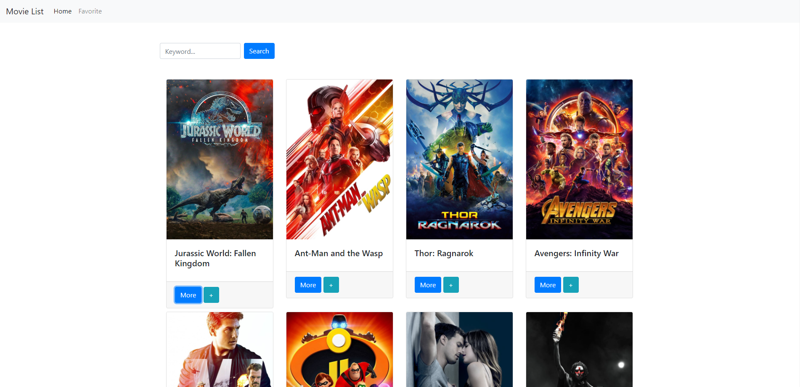
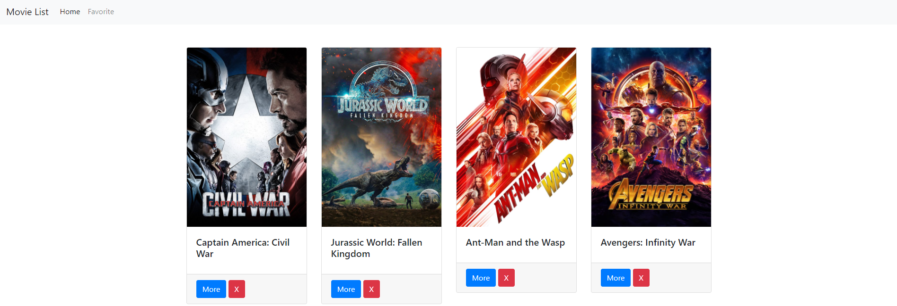
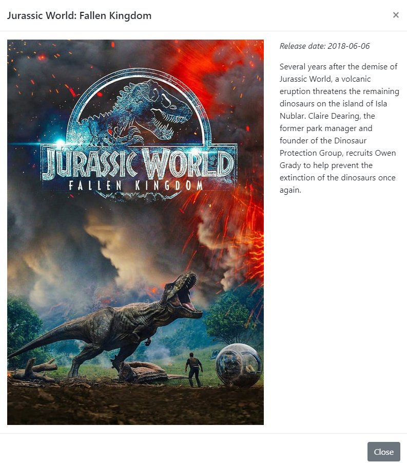

# Resume

使用HTML及JavaScript，並以Ajax技術串接資料庫API，所打造電影清單網站。

## 網站主要功能

- 使用者可在首頁瀏覽電影清單。
- 使用者可點擊左上角Home及Favorite，切換首頁及收藏頁面。
- 使用者可點擊分頁，瀏覽不同頁面的電影清單。
- 使用者可點擊More按鈕，查看電影詳情。
- 使用者可點擊+按鈕，將指定電影新增至收藏清單。
- 使用者可輸入關鍵字，查詢指定電影。
- 在收藏頁面，使用者可點擊X按鈕，移除已收藏電影。
- 網頁排版會根據使用者的螢幕大小而有不同呈現方式。

## 專案畫面截圖

## 開發環境

- Visual Studio Code
- HTML
- JavaScript
- Bootstrap

## 專案開發人員

> [HowNLuo](https://github.com/HowNLuo)